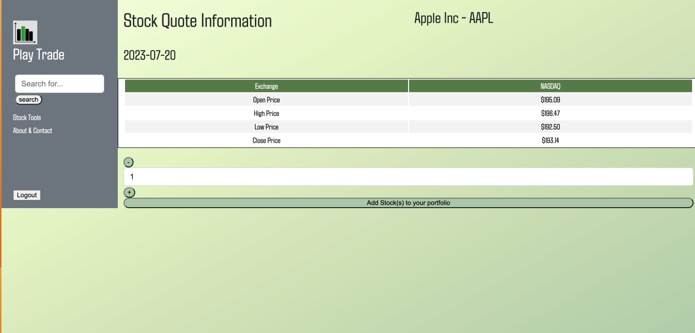

# Play Trade 

## Motivation
We created this project with the intention of providing an application 
to help people with no prior knowledge approach the stock market. We wanted people to build their investing skills and knowledge without risk so they can apply those skills to real investing.

## Description

Play Trade was made with the intention to help users learn about the stock market and trading trends. This app uses a combination of SQL, Bootstrap, Handlebars, JavaScript, CSS, highcharts API, and twelve data API. THe user can search for stocks to add to their portfolio and track the real life perfomance of the stock. There is also informative content 
for the user to read to gain a better understanding of the stock market.

## Table of Contents 

- [Usage](#usage)
- [Play Trade Images](#images)
- [Creators](#creators)
- [Deployed] (#deployedapp)

## Usage 

Create an account to start your learning journey! Once you are logged in you will be able to search and add stocks to your portfolio. To add a stock, type the name of the company in the search bar and press enter or press the button. Results that match the query will be shown. Press the "info" button on the stock you want to see its price and have the option to add it to your portfolio. Select the number of shares and press the add to portfolio button to add the stock. Go to the home page to view your portfolio.

# Images

## Deployed App 

https://play-trade-3e0a6365bb54.herokuapp.com/login 

# Creators

- Amadeus Machuca
- Peter Conenna
- North Goddard 
- Stephanie Angelito 

