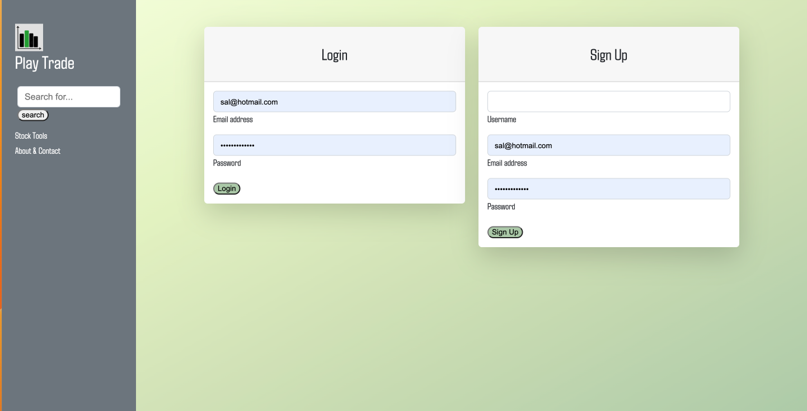

# Play Trade by Mock Market Makers

## Table of Contents 

- [Description](#description)
- [Usage](#usage)
- [Play Trade Images](#images)
- [Creators](#creators)
- [Deployed] (#deployedapp)

## Description 

Play Trade is an app designed to educate users on the stock market and help build confidence when you begin making your investments. A user can build a fake portfolio using real stock market data and see their portfolio grow or shrink over time. This allows anyone to practice and gain confidence in their ability to invest and navigate the market.

We all have a friend or family members who are interested in stocks but are too scared to invest real money. Play Trade is the perfect app to immerse yourself in the stock market without the fear of losing money. Now anyone can claim to be a market genius, study market trends, and make wise long-term investments without gambling real money.

Create an account to start your learning journey! Once you are logged in you will be able to search and add stocks to your portfolio. 
To add a stock, type the name of the company in the search bar and press enter or press the button. 
Results that match the query will be shown. 
Press the "info" button on the stock you want to see its price and have the option to add it to your portfolio. 
Select the number of shares and press the add to portfolio button to add the stock. Go to the home page to view your portfolio.

Technologies Used:
- Node.js and Express.js
- Handlebars.js
- SQL (https://www.mysql.com/)
- Bootstrap (https://getbootstrap.com/)
- HighCharts API (https://www.highcharts.com/)
- Twelve Data API (https://twelvedata.com/)
- Axios API (https://www.npmjs.com/package/axios)

## Usage 
Create an account to start your learning journey! Once you are logged in you will be able to search and add stocks to your portfolio. 
To add a stock, type the name of the company in the search bar and press enter or press the button. 
Results that match the query will be shown. 
Press the "info" button on the stock you want to see its price and have the option to add it to your portfolio. 
Select the number of shares and press the add to portfolio button to add the stock. Go to the home page to view your portfolio.
 

# Images

## Deployed App 

https://play-trade-3e0a6365bb54.herokuapp.com/login 

# Creators

- Amadeus Machuca (https://github.com/microvac23)
- Peter Conenna (https://github.com/pconenna)
- North Goddard (https://github.com/northgoddard)
- Stephanie Angelito (https://github.com/sangelito)

